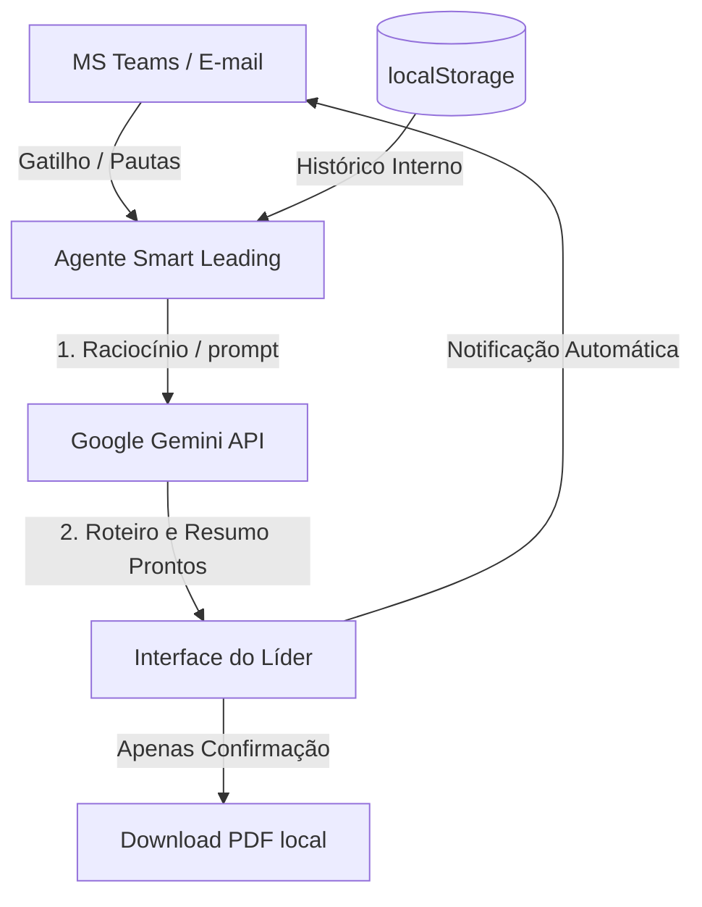

# 🚀 Técnicas de Design Agent-First no Mercado

Este documento compila as melhores práticas e padrões arquiteturais utilizados pela indústria para transformar sistemas de registro passivos (SoR) em aplicações orientadas a agentes autônomos.

---

## 1. Técnicas Modernas de Mercado

### A. Omnicanalidade e Micro-Interfaces (Omnichannel & Headless UI)
*   **Conceito:** O usuário interage com o sistema onde ele já trabalha (Slack, Teams, WhatsApp, E-mail) por meio de Adaptive Cards e mensagens interativas, sem precisar abrir a aplicação web principal.
*   **Aplicação:** O liderado preenche os sentimentos e valida as atas pendentes diretamente no card do Microsoft Teams.

### B. Ata Autônoma via Ditado de Tópicos e Expansão Semântica (Bullet-to-Ata)
*   **Conceito:** A IA expande anotações rápidas e fragmentadas (ou ditados por voz curtos de 30 segundos) em atas estruturadas e PDIs formais, eliminando a digitação manual sem a necessidade de gravar conversas por inteiro.
*   **Aplicação:** Em vez de digitar, o líder fala ou escreve palavras-chave rápidas (ex: *"Carlos estudar AWS 3m", "Vinicio refatorar login sexta"*). O agente cruza isso com a pauta e o Framework de Levels, redigindo a ata de 5 blocos e criando as tarefas correspondentes automaticamente.

### C. Orquestração Multi-Agente (Collaborative Multi-Agent Networks)
*   **Conceito:** Divisão do trabalho entre agentes especializados que colaboram entre si (ex: um agente focado em avaliar Levels de carreira, outro focado em escuta e mediação de conflitos, outro em telemetria do RH).
*   **Aplicação:** O "Agente de Carreira" analisa as metas de PDI com base no Framework de Levels e debate com o "Agente de Clima" para sugerir o melhor plano comportamental para o liderado.

---

## 2. Como tornar o Smart Leading mais Agent-First?

Temos oportunidades claras de evolução no projeto utilizando o backlog de escala (Fase 4):

1.  **Redução de Formulários:** Substituir os campos de digitação manual de pauta no [Home.jsx](file:///c:/Users/Pulse%20Mais/24+1/SmartLeading-ClearIT/frontend/src/views/Home.jsx) por uma caixa de entrada simples de "Prompt do Gestor" (*"Quero falar sobre a promoção do Carlos"*). O agente se encarrega de buscar no `localStorage` as atas passadas, as pendências de PDI e estruturar o roteiro completo.
2.  **Validação por Resposta do Teams/E-mail:** Em vez de exigir que o liderado acesse a SPA e selecione a aba para validar atas (F-16), o agente envia o link mágico no e-mail e a validação ocorre por meio de uma resposta simples (como clicar em "Sim, confirmo" direto no e-mail). Conforme estabelecido na [ADR 0004](file:///c:/Users/Pulse%20Mais/24+1/SmartLeading-ClearIT/docs/knowledge-base/adr/0004-validacao-bilateral-omnichannel.md).
