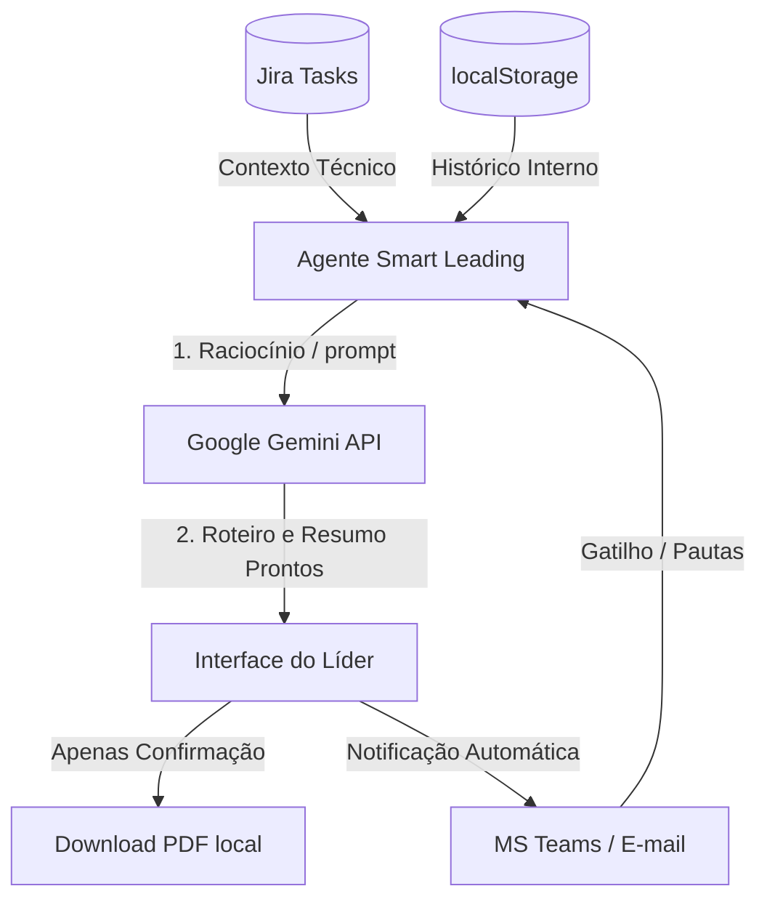

# 🚀 Técnicas de Design Agent-First no Mercado

Este documento compila as melhores práticas e padrões arquiteturais utilizados pela indústria para transformar sistemas de registro passivos (SoR) em aplicações orientadas a agentes autônomos.

---

## 1. Técnicas Modernas de Mercado

### A. Gatilhos Proativos (Proactive Triggers)
*   **Conceito:** O agente não espera o clique do usuário. Ele monitora eventos do sistema (cron jobs, logs, inatividades) e inicia fluxos de trabalho.
*   **Aplicação:** Se um liderado ficar 28 dias sem rito, o agente inicia uma conversa no Teams com o colaborador para coletar pautas e, em seguida, envia um resumo de preparação estruturado ao líder.

### B. Omnicanalidade e Micro-Interfaces (Omnichannel & Headless UI)
*   **Conceito:** O usuário interage com o sistema onde ele já trabalha (Slack, Teams, WhatsApp, E-mail) por meio de Adaptive Cards e mensagens interativas, sem precisar abrir a aplicação web principal.
*   **Aplicação:** O liderado preenche os sentimentos e valida as atas pendentes diretamente no card do Microsoft Teams.

### C. Ingestão e Síntese em Background (Background Context Gathering)
*   **Conceito:** Agentes em segundo plano consolidam informações de múltiplas APIs (Jira, GitHub, Outlook, e-mails) para criar um "Super-Contexto" atualizado.
*   **Aplicação:** O copiloto lê os commits recentes do liderado no GitHub e suas tarefas no Jira para montar a pauta técnica da 1:1 de forma automática.

### D. Ata Autônoma via Transcrição (Meeting Intelligence)
*   **Conceito:** Extração automática de resumos, sentimentos e combinados a partir de áudios/vídeos de reuniões transcritos.
*   **Aplicação:** O líder grava a 1:1 e o agente transcreve a conversa, detecta quem assumiu qual compromisso, gera o rascunho da ata e do PDI automaticamente, exigindo apenas revisão e aceite final (Sign-off) das duas partes.

### E. Orquestração Multi-Agente (Collaborative Multi-Agent Networks)
*   **Conceito:** Divisão do trabalho entre agentes especializados que colaboram entre si (ex: um agente focado em avaliar Levels de carreira, outro focado em escuta e mediação de conflitos, outro em telemetria do RH).
*   **Aplicação:** O "Agente de Carreira" analisa as metas de PDI com base no Framework de Levels e debate com o "Agente de Clima" para sugerir o melhor plano comportamental para o liderado.

---

## 2. Como tornar o Smart Leading mais Agent-First?

Temos oportunidades claras de evolução no projeto utilizando o backlog de escala (Fase 4):

1.  **Redução de Formulários:** Substituir os campos de digitação manual de pauta no [Home.jsx](file:///c:/Users/Pulse%20Mais/24+1/SmartLeading-ClearIT/frontend/src/views/Home.jsx) por uma caixa de entrada simples de "Prompt do Gestor" (*"Quero falar sobre a promoção do Carlos"*). O agente se encarrega de buscar no `localStorage` as atas passadas, as pendências de PDI e estruturar o roteiro completo.
2.  **Validação por Resposta do Teams/E-mail:** Em vez de exigir que o liderado acesse a SPA e selecione a aba para validar atas (F-16), o agente envia o link mágico no e-mail e a validação ocorre por meio de uma resposta simples (como clicar em "Sim, confirmo" direto no e-mail).
3.  **Detecção Automática de Gaps de Cadência (Cron Jobs no Backend):** Adicionar um script em background no FastAPI que verifica diariamente a tabela PostgreSQL e dispara e-mails preventivos para os líderes com a mensagem: *"Você tem 3 colaboradores da sua equipe que entram na zona de risco de cadência esta semana. Deseja que eu prepare os roteiros?"*
