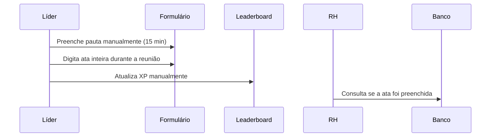
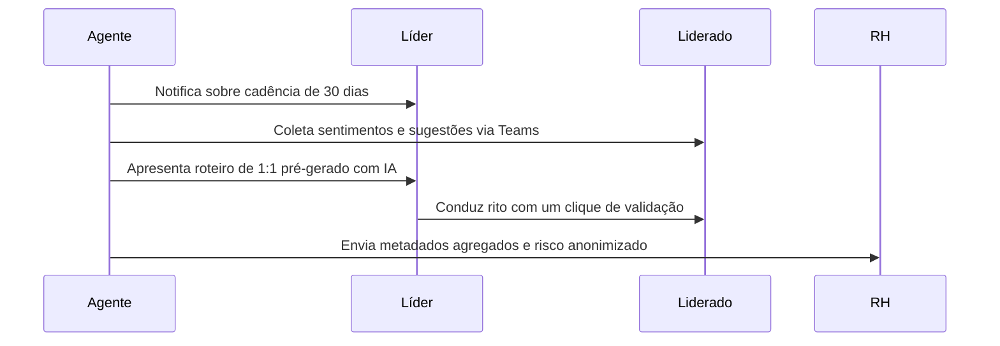

# 🧠 Agent-First vs. System of Record (SoR)

Este documento compara a arquitetura tradicional de registro passivo com o paradigma emergente de colaboração ativa baseada em agentes autônomos.

---

## 1. Visão Geral

*   **System of Record (SoR):** Sistemas focados no armazenamento e integridade de dados (ex: ERPs, CRMs e portais de RH tradicionais). São reativos e dependem inteiramente de entrada manual pelo usuário.
*   **Agent-First (System of Agent):** Sistemas projetados em torno de agentes de IA inteligentes e proativos. O software atua como um colaborador autônomo, antecipando necessidades, automatizando tarefas e auxiliando na tomada de decisões.

---

## 2. Conceitos-Chave

| Característica | System of Record (SoR) | Agent-First (Agentic) |
| :--- | :--- | :--- |
| **Postura** | Passiva (espera a entrada do usuário) | Proativa (sugere ações e inicia fluxos) |
| **Entrada de Dados** | Formulários manuais exaustivos | IA extrai, resume e preenche dados |
| **Navegação** | Guiada por menus e cliques | Guiada por fluxos lógicos e diálogo natural |
| **Foco** | Auditoria e conformidade (passado) | Produtividade e otimização (futuro) |
| **Exemplo Comum** | Folha de pagamento, cadastro de PDI | Copiloto que redige rascunhos e analisa risco |

---

## 3. Exemplos Práticos (Mapeamento Smart Leading)

### Fluxo de 1:1 no Modelo SoR (Passivo)

### Fluxo de 1:1 no Modelo Agent-First (Ativo)

---

## 4. Armadilhas (Gotchas)

*   **Bypass de Decisão (Falta de Human-in-the-Loop):** Nunca permita que o agente tome decisões de impacto (como demissões, promoções ou alertas públicos de performance) sem a aprovação explícita do gestor humano.
*   **Alucinação de Dados (Hallucinations):** Agents-First requerem guardrails (firewalls semânticos) para evitar que a IA invente combinados passados ou dados que não existiram.
*   **Aversão à Burocracia:** Se o agente exigir que o usuário confirme pautas extensas ou execute passos manuais burocráticos, o engajamento falhará. A ação do agente deve economizar tempo, não criar novas tarefas.
