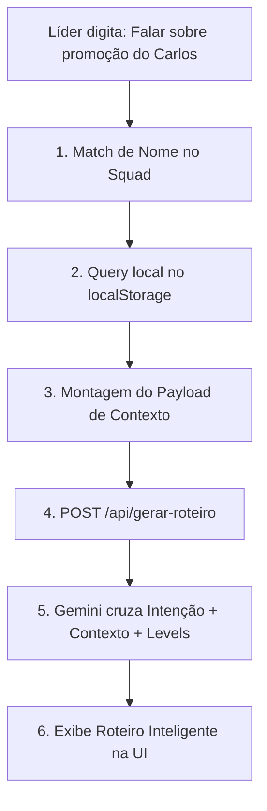

# KB: Engenharia de Prompt do Gemini e Geração de PDFs (ClearIT)

> **Contexto Técnico:** Guia detalhado da infraestrutura de IA e do motor de geração de documentos PDF do Smart Leading. Este documento descreve as decisões de design de software que regem a chamada ao modelo `gemini-2.5-flash` e a renderização com `FPDF`.

---

## 1. Visão Geral
O núcleo operacional do Smart Leading depende da geração em tempo real de roteiros personalizados estruturados pela IA, que posteriormente são limpos e convertidos em um documento oficial legível por humanos (PDF) para governança corporativa. 

Este guia documenta o ciclo de vida do prompt e as transformações necessárias para que a saída de texto livre da IA seja mapeada em um layout estruturado de duas páginas, respeitando a privacidade dos dados (LGPD) e mitigando bugs comuns de renderização.

---

## 2. Conceitos-Chave

### A. Estratégia de Resposta Bipartida (Split Response)
A API do Gemini é instruída a retornar um único payload de texto que encapsula duas partes distintas:
1. **Roteiro do Líder:** Confidencial, com dicas de postura, tom e perguntas baseadas em comportamento.
2. **Ata de Alinhamento:** Resumo executivo formal que será enviado ao RH.

A divisa entre esses blocos é demarcada pela tag `--- ATA OFICIAL ---`. Essa abordagem permite uma única chamada à API, reduzindo custos de token e latência.

### B. Limpeza e Normalização (Sanitization)
O Markdown bruto gerado pela IA (negritos com asteriscos, títulos com hashtags e emojis) não é compatível nativamente com o motor de renderização `FPDF` básico em fontes padrão (Arial, Times). 
Portanto, o texto passa por um pipeline de limpeza por expressões regulares (Regex) para remover esses artefatos antes da montagem do PDF.

### C. Isolamento Dinâmico de Identificadores (Privacy by Design)
Os dados sensíveis (nome do líder, nome do liderado) nunca devem trafegar pela internet. O modelo de linguagem gera uma ata genérica/abstrata, e o software do frontend (`app.py` + `pdf_maker.py`) substitui ou insere localmente essas strings apenas na montagem dos campos de cabeçalho e rodapé do PDF.

---

## 3. Exemplos Práticos

### A. Fluxo de Sanitização Regex no PDF Maker (`pdf_maker.py`)
Aqui está a implementação do pipeline de sanitização que remove artefatos incompatíveis com fontes básicas PDF:

```python
import re

def limpar_texto(texto):
    if not texto: return ""
    
    # 1. Remove cabeçalhos estruturais de marcação da IA
    texto = re.sub(r'(?i).*PARTE 2.*?RESUMO DO ALINHAMENTO.*', '', texto)
    texto = re.sub(r'(?i)--- ATA OFICIAL ---', '', texto)
    
    # 2. Converte listas de asteriscos para traço simples (-)
    texto = re.sub(r'^\s*\*\s+', '- ', texto, flags=re.MULTILINE)
    
    # 3. Elimina negritos/itálicos de markdown (*)
    texto = texto.replace('*', '')
    
    # 4. Remove marcações de cabeçalhos Markdown (#)
    texto = re.sub(r'#+\s*', '', texto)
    
    # 5. Ignora caracteres não-latin1 (emojis e caracteres especiais estendidos)
    texto = str(texto).encode('latin-1', 'ignore').decode('latin-1')
    
    # 6. Previne excesso de quebras de linha
    texto = re.sub(r'\n{3,}', '\n\n', texto)
    
    return texto.strip()
```

### B. Divisão Dinâmica de Páginas no PDF Maker
O design do documento impõe que a Ata do RH fique na **Página 1** e a Gamificação (XP/Badges/Missões) seja deslocada automaticamente para a **Página 2** se detectada no texto.

```python
# Procura pela marcação de Gamificação
match = re.search(r'(?i)(bloco de )?gamifica[çc][ãa]o', texto_limpo)

if match:
    texto_resumo = texto_limpo[:match.start()].strip()
    texto_gamificacao = texto_limpo[match.end():].strip()
else:
    texto_resumo = texto_limpo
    texto_gamificacao = ""
```

---

## 4. Fluxo do Prompt do Gestor e Coleta do LocalStorage

Em vez de o líder preencher vários campos estruturados na interface de preparação de 1:1, a plataforma adota o conceito de "Redução de Formulários", oferecendo apenas uma caixa de entrada de prompt livre: 

> 💬 *"Sobre o que você deseja conversar com [Colaborador] hoje?"*  
> *Exemplo: "Quero falar sobre a promoção do Carlos e cobrar o PDI de AWS"*



### A. O que o sistema busca no LocalStorage?
Ao identificar que o rito é com o liderado **Carlos** (ID `101`), o frontend executa buscas sob as seguintes chaves do `localStorage`:
*   **`@clearit-atas-squad` (Últimas Atas):** Extrai o bloco de *"Acordos e Próximos Passos"* da última ata registrada para puxar os combinados passados.
*   **`@clearit-pdi` (PDIs ativos):** Busca as metas de desenvolvimento de carreira que estão em andamento e seus prazos.
*   **`@clearit-tasks` (Checklist de Ações Micro):** Filtra tarefas que ficaram com status *"pendente"* ou *"expirada"*.

### B. Payload de Contexto enviado ao Backend
O frontend empacota a intenção do líder e o histórico coletado no JSON abaixo e envia à API:

```json
{
  "lideradoId": "101",
  "nomeLiderado": "Carlos Eduardo",
  "cargo": "Engenheiro Front-end Pleno",
  "direcionamentoLider": "Quero falar sobre a promoção do Carlos e cobrar o PDI de AWS",
  "contextoHistorico": {
    "acordosAtaAnterior": [
      { "descricao": "Refatorar componente de Login", "status": "concluida" },
      { "descricao": "Atualizar documentação do Storybook", "status": "expirada" }
    ],
    "pdiAtivo": [
      { "acao": "Finalizar curso de React Avançado", "prazo": "10/07/2026", "status": "Em andamento" }
    ]
  }
}
```

### C. Prompt gerado pelo Backend (FastAPI) para a IA
O FastAPI recebe o JSON, anexa as regras da metodologia de liderança e a matriz de Levels da ClearIT e monta o prompt final para o Gemini:

```text
Você é o copiloto de liderança Smart Leading (ClearIT).
O líder Daniel Nascimento iniciou a preparação de uma 1:1 com Carlos Eduardo (Engenheiro Front-end Pleno).

INTENÇÃO DE FOCO DO GESTOR:
"Quero falar sobre a promoção do Carlos e cobrar o PDI de AWS"

HISTÓRICO DO COLABORADOR (Extraído do localStorage):
- Acordos Anteriores: Concluiu "Refatorar login", mas a tarefa "Atualizar storybook" expirou.
- PDI Ativo: "Finalizar curso de React Avançado" (Prazo: 10/07/2026 - Em andamento).

DIRETRIZ DA MATRIZ DE LEVELS (ClearIT):
Para promoção para Sênior, o colaborador precisa demonstrar competências de "Arquitetura Limpa" e "Liderança Técnica em projetos front-end".

INSTRUÇÕES PARA O ROTEIRO:
1. Monte um roteiro de 5 blocos (Metodologia ClearIT).
2. No bloco de Desenvolvimento/Carreira, sugira 2 perguntas específicas baseadas na transição de Pleno para Sênior para ajudar o líder a validar se o Carlos já cumpre os requisitos de promoção.
3. No bloco de Status, inclua um lembrete para cobrar a tarefa expirada de storybook.
```

---

## 5. Armadilhas (Gotchas)

> [!WARNING]
> **Quebra de codificação Latin-1:** O método `encode('latin-1', 'ignore')` remove emojis silenciosamente para evitar que o FPDF quebre a execução. Contudo, ele também removerá aspas inteligentes (`“` e `”`) ou travessões (`—`) se eles não estiverem na tabela Latin-1. Certifique-se de que os prompts orientem a IA a usar apenas caracteres ASCII/Latin-1 padrão.

> [!IMPORTANT]
> **Assinaturas Orfãs:** Se a altura acumulada da página Y (`pdf.get_y()`) exceder **250**, o motor deve adicionar uma nova página explicitamente antes de desenhar as linhas de assinatura. Caso contrário, as linhas de assinatura serão renderizadas no limite inferior da página ou serão cortadas.

> [!CAUTION]
> **Modificações de Modelo (Gemini):** O código usa a especificação de modelo `gemini-2.5-flash`. Caso haja mudança para outro modelo ou versão da biblioteca `google-generativeai`, valide a compatibilidade de inicialização do método `genai.GenerativeModel`.
