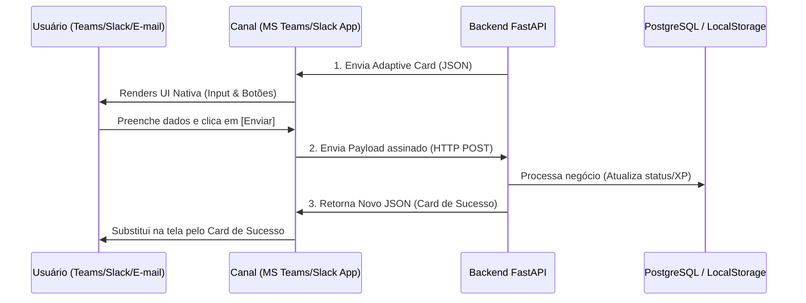

# 🔌 Omnicanalidade e Headless UI com Adaptive Cards

Este documento detalha o funcionamento técnico da arquitetura que permite interações dinâmicas através de MS Teams, Slack e E-mail sem expor a interface web.

---

## 1. Visão Geral da Arquitetura

O conceito de **Headless UI** em sistemas orientados a agentes permite que a lógica de aplicação e a IA fiquem centralizadas no servidor (FastAPI), enquanto a interface é renderizada nativamente em canais de comunicação existentes usando um formato comum de dados: **Adaptive Cards (JSON)**.



---

## 2. Tecnologias por Canal

### A. Microsoft Teams (Azure Bot Framework)
*   Utiliza a especificação de **Adaptive Cards** em formato JSON.
*   **Segurança:** Cada chamada webhook enviada pelo Teams ao nosso backend é assinada criptograficamente pela Microsoft. O FastAPI valida a assinatura do token JWT.

### B. Slack (Bolt SDK & Block Kit)
*   Utiliza a especificação **Block Kit** do Slack.
*   **Segurança:** Validação usando assinaturas hexadecimais HMAC-SHA256 (`X-Slack-Signature`) enviadas no cabeçalho HTTP de cada clique de ação.

### C. E-mail Interativo (Outlook Actionable Messages)
*   HTML de e-mail comum injetado com um bloco `<script type="application/adaptivecard+json">` contendo o payload em JSON-LD.
*   Permite que o usuário do Outlook responda a formulários de clima ou aprove atas de 1:1 direto do painel de leitura do e-mail.

---

## 3. Exemplo Técnico: Payload JSON de um Card de Validação de 1:1

Este JSON é montado dinamicamente pelo FastAPI e enviado via POST ao webhook do Teams:

```json
{
  "$schema": "http://adaptivecards.io/schemas/adaptive-card.json",
  "type": "AdaptiveCard",
  "version": "1.4",
  "body": [
    {
      "type": "TextBlock",
      "text": "📢 Validação Bilateral de 1:1",
      "weight": "Bolder",
      "size": "Medium"
    },
    {
      "type": "TextBlock",
      "text": "Olá Carlos! Daniel Nascimento finalizou a ata da sua reunião de 1:1. Responda abaixo para validar o encontro:",
      "wrap": true
    },
    {
      "type": "Input.Toggle",
      "id": "sentiuClareza",
      "title": "Eu saí da reunião com pelo menos 3 próximos passos claros.",
      "value": "false"
    },
    {
      "type": "Input.Toggle",
      "id": "gerouValor",
      "title": "A conversa gerou valor para o meu desenvolvimento.",
      "value": "false"
    }
  ],
  "actions": [
    {
      "type": "Action.Execute",
      "title": "Validar e Confirmar Rito",
      "id": "btnValidar",
      "url": "https://api.clearit.com/api/webhooks/valida-rito",
      "data": {
        "ritoHash": "hash_rito_10293",
        "lideradoId": "101"
      }
    }
  ]
}
```

---

## 4. O Fluxo de Retorno e Atualização (Replicação de Estado)

*   **Substituição In-Place:** Quando o usuário clica em "Validar e Confirmar Rito", o canal envia as respostas de `sentiuClareza` e `gerouValor` para o FastAPI.
*   **Atualização Silenciosa:** O FastAPI processa o XP, altera o status do rito de `"pendente"` para `"concluido"` no PostgreSQL e retorna um novo JSON mais simples (ex: *"Ata validada com sucesso! +40 XP creditados."*).
*   **UX Limpo:** O Teams substitui na hora o card de inputs pelo card de confirmação, garantindo que o usuário não clique duas vezes e que não haja poluição visual no chat.
