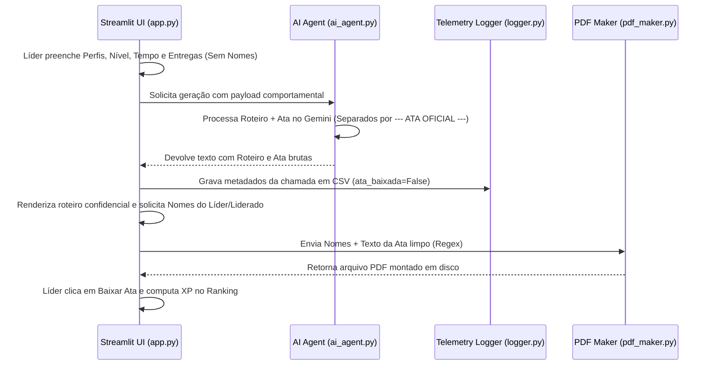

# KB: Visão Geral e Análise do Briefing - Smart Leading (ClearIT)

> **Contexto de Negócio:** Análise detalhada do Desafio A - Recursos Humanos da Clear IT. Este documento atua como base de conhecimento (KB) do projeto para alinhar a inteligência artificial (@meta) com os objetivos estratégicos, restrições e perfis de usuário mapeados no briefing.

---

## 1. Visão Geral
O **Smart Leading** é um copiloto de liderança focado em apoiar os gestores da Clear IT na preparação, condução e documentação de feedbacks e reuniões de 1:1. 

### Utilidade e Valor Estratégico:
- **Nivelamento de Lideranças:** Apoia gestores novos ou técnicos que carecem de maturidade emocional/teórica em gestão de pessoas.
- **Redução de Sobrecarga Cognitiva:** Automatiza a estruturação e o roteiramento de reuniões complexas e difíceis.
- **Governança de RH (Analytics):** Consolida dados operacionais e de adesão (telemetria oculta) para alimentar comitês de calibração de performance e People Analytics.
- **Engajamento dos Liderados:** Introduz pilares gamificados (XP, badges e missões práticas) vinculados ao tema estratégico de 2026: *"Adaptabilidade, Performance e Resultado"*.

---

## 2. Conceitos-Chave

### A. Perfis de Liderança (Público Usuário)
Para que a ferramenta seja adotada, o tom e a profundidade dos roteiros gerados devem se adaptar a três perfis distintos de usuários:
1. **Líder Técnico (Tech Lead):**
   - **Comportamento:** Baixa tolerância a burocracias ou jargões densos de RH.
   - **Necessidade:** Roteiros diretos, práticos, pragmáticos e objetivos.
2. **Líder em Transição (Técnico -> Gestão):**
   - **Comportamento:** Quer fazer o processo acontecer, mas falta repertório para lidar com a complexidade emocional de conversas difíceis (feedback de baixa performance, demissão, atrito de equipe).
   - **Necessidade:** Roteiro detalhado, passo a passo, falas sugeridas e validações.
3. **Líder Engajado com Pessoas:**
   - **Comportamento:** Já acredita no valor do rito de feedback/1:1, mas esbarra na falta de tempo, organização e estrutura de acompanhamento.
   - **Necessidade:** Foco em organização rápida, cadência de frequência e facilidade na consolidação de planos (PDIs).

### B. Gamificação de Feedback
Para evitar que o feedback seja retrospectivo ou puramente formal, o sistema deve incluir:
- **XP (Pontos de Experiência):** Atribuição baseada em entregas ou superação de desafios práticos.
- **Badges (Crachás de Reconhecimento):** Medalhas simbólicas para celebrar comportamentos de alta performance.
- **Missões:** Desafios ou tarefas práticas de curto prazo focados no desenvolvimento individual do liderado.

### C. LGPD e Privacy by Design (Restrição Crítica)
- **Premissa:** Nenhum dado pessoal identificável (nomes, CPFs, condições de saúde) deve ser enviado na chamada da API do Gemini.
- **Arquitetura:** O prompt utiliza apenas contexto de cargo, nível (L1-L4), perfis comportamentais e resumo de gaps. Os dados sensíveis (nomes dos colaboradores e líderes) devem ser injetados exclusivamente no frontend, no momento da montagem e download do PDF da Ata de Reunião localmente.

### D. Telemetria Oculta (Analytics)
- Registro anônimo de logs operacionais (data, perfis de líderes e liderados mais ativos, geração de atas) gravados em um arquivo CSV local (`telemetry_logs.csv`) para subsidiar o People Analytics do RH de forma legal e em conformidade com as regras de privacidade.

---

## 3. Arquitetura Lógica e Estrutura de Código

O projeto é estruturado utilizando uma separação clara de responsabilidades (Separation of Concerns):

```
clear-it-assistant/
├── assets/              # Folhas de estilo (style.css) e logo.png
├── data/                # Telemetria anônima (telemetry_logs.csv)
├── docs/                # Requisitos de Negócio e Roadmap
└── src/                 # Código-fonte da aplicação Streamlit
    ├── app.py           # Ponto de entrada (UI e Abas da SPA)
    ├── components/      # Componentes visuais
    │   └── ui_forms.py  # Renderização do formulário principal
    ├── services/        # Integrações e Motores
    │   ├── ai_agent.py  # Integração com API Google Gemini e Mega-Prompt
    │   └── pdf_maker.py # Motor FPDF para formatação e exportação
    └── utils/           # Utilitários auxiliares
        └── logger.py    # Geração dos logs de telemetria em CSV
```

### A. Fluxo de Geração e Isolamento de Identidade


---

## 4. Estado de Implementação dos Critérios de Aceite

| ID / Área | Descrição do Requisito | Status | Notas |
|---|---|---|---|
| **Segurança** | Sem dados sensíveis no payload da IA | **Concluído** | Validado no pipeline da chamada do Gemini |
| **Segurança** | Injeção de nomes e assinaturas localmente no PDF | **Concluído** | Feito no `pdf_maker.py` e `app.py` |
| **UX/UI** | Fluxo de navegação em tela única (SPA) | **Concluído** | Abas do Streamlit usadas no `app.py` |
| **UX/UI** | Trava de inputs (freeze) durante spinner da IA | **Concluído** | Controlado por `st.session_state.is_generating` |
| **Telemetria** | Registro silencioso no CSV local | **Concluído** | Implementado em `logger.py` |
| **Gamificação**| Ranking de Líderes com contagem de reuniões | **Concluído** | Exibido na aba "Ranking de Líderes" |
| **Telemetria** | Registro de gatilho "Compartilhar Ata" e flag_compartilhado | **Pendente** | Necessário implementar botão de compartilhamento rápido |
| **RH** | Cópia automatizada da ata encriptada para o RH | **Pendente** | Funcionalidade para futuras fases de evolução |
| **UX/UI** | Redirecionamento automático pós-ata para o Perfil | **Pendente** | Integração de estados do painel do usuário |

---

## 5. Armadilhas (Gotchas)

> [!WARNING]
> **Quebra de Página no FPDF:** Se o texto consolidado da Ata ultrapassar 250 pontos em Y, o `pdf_maker.py` adiciona uma nova página para evitar que as assinaturas fiquem soltas fora do rodapé ou fiquem cortadas. Qualquer modificação de margem deve levar em conta o método `pdf.get_y()`.

> [!IMPORTANT]
> **Formato da Tag de Divisão:** A divisão entre Roteiro e Ata de IA depende estritamente da string `--- ATA OFICIAL ---` gerada pela IA. Se a IA gerar variações como `---Ata Oficial---` ou markdown alternativo, o split no `app.py` pode falhar. O prompt no `ai_agent.py` instrui o modelo de forma rígida a manter a correspondência exata.

> [!CAUTION]
> **Conformidade com a LGPD:** O sistema de Logs Ocultos não deve, sob hipótese alguma, armazenar o conteúdo textual da reunião (como a string contida em `entregas_recentes` ou `acordos`) no arquivo CSV. Somente variáveis categóricas abstratas (ex: `Lider Técnico`, `Liderado L2`, `Comportamento Analítico`) são permitidas.

> [!NOTE]
> **Limpeza de Caracteres Especiais:** Como a biblioteca `fpdf` padrão possui limitações com caracteres Unicode estendidos, a função `limpar_texto` executa um encode/decode em `latin-1` ignorando caracteres incompatíveis para evitar quebras abruptas na renderização do PDF.
