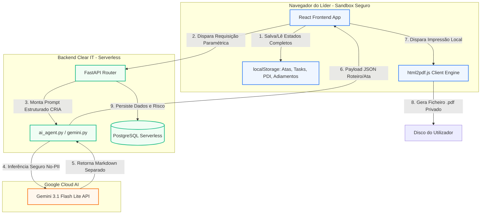

# 🛠️ Contexto Técnico e Arquitetura - Smart Leading

> Este arquivo é a fonte de verdade para Engenharia. O agente `@engineer` atualizará este arquivo com planos de implementação, especificações técnicas e decisões arquiteturais sob as diretrizes do [Engineer Cycle (@engineer)](file:///c:/Users/Pulse%20Mais/24+1/SmartLeading-ClearIT/docs/onion-cycles.md#L29).

## 1. Stack Tecnológica
* **Frontend:** React (Vite), Tailwind CSS (Interface responsiva e gráficos puros nativos), Lucide Icons (Iconografia unificada).
* **Backend:** Python 3 (FastAPI) - Router serverless, telemetria e orquestração.
* **Inteligência Artificial:** Google Gemini API (Modelo `gemini-3.1-flash-lite`) operando com engenharia de prompts estruturada via JSON/Markdown.
* **Persistência e Estado:** 
  - **Client-Side:** `localStorage` (Cofre isolado no browser para persistência de atas locais e rascunhos de PDIs).
  - **Server-Side (Serverless DB):** Banco de Dados **PostgreSQL Serverless** (ex: Neon/Supabase) para persistência segura de logs de telemetria, sinalizações de risco nominais da empresa e status bilateral de validação dos ritos.
* **Geração de Documentos:** `html2pdf.js` para renderização perfeita de PDFs no cliente sem sobrecarregar o servidor.

## 2. Diagrama de Arquitetura do Sistema (Mermaid)

O diagrama abaixo ilustra o fluxo de dados unificado, o isolamento do cofre local e a ponte paramétrica com o motor de IA:

---

## 3. Visão Geral dos Componentes e Fluxo de Dados (Data Flow)

### 3.1. Visão Geral dos Componentes
*   **Front-end (Client & Local Sandbox):** React.js (via Vite) + Tailwind CSS + Lucide Icons. Responsável pela renderização responsiva (SPA), Cross-Routing de dados (Navegação contextual), dashboards interativos e compilação Client-Side de HTML para PDF via `html2pdf.js`. O cofre local (`localStorage`) persiste atas detalhadas, rascunhos e PDIs de forma isolada, garantindo privacidade e agilidade nas dashboards.
*   **Back-end (API Gateway & Telemetry):** Python 3 + FastAPI. Atua como gateway seguro de IA (anonimização e higienização semântica), orquestra as inferências e persiste metadados de telemetria, sinalizações de risco nominais da empresa e status bilateral de validação dos ritos no banco PostgreSQL Serverless.
*   **Módulo de IA (`gemini.py`):** Encapsula a integração segura com a API do Google Gemini (utilizando o modelo `gemini-3.1-flash-lite`) operando com engenharia de prompts estruturada via JSON/Markdown (Roteiro vs. Ata Oficial).

### 3.2. Fluxos Principais de Dados (Data Flow)
*   **Fluxo A (Geração Paramétrica - Metodologia CRIA):**
    1. O líder preenche os parâmetros de contexto (Senioridade, Momento, Entregas) no front-end.
    2. O frontend realiza a tokenização de dados sensíveis locais (como CPF/RG) substituindo por `[DOCUMENTO]`.
    3. O React envia o payload anonimizado em `JSON` via `POST` para `/api/gerar-roteiro`.
    4. O **FastAPI** recebe o payload, higieniza termos de saúde sensíveis via gateway de privacidade e anexa as instruções da Metodologia CRIA antes de enviar ao Gemini.
    5. O Gemini processa o contexto parametrizado e retorna o roteiro estruturado.
    6. O FastAPI repassa a resposta para o React, que renderiza a interface reativamente.
*   **Fluxo B (Assinatura, Armazenamento e Telemetria):**
    1. O líder conduz a 1:1, formaliza os acordos e aciona o download da Ata Oficial.
    2. O React aciona a biblioteca `html2pdf.js` para capturar a DOM e compilar o PDF localmente na máquina do gestor.
    3. O front-end salva a Ata e atualiza os PDIs no `localStorage`, creditando XP (preparação e condução) e marcando o XP final de validação como pendente.
    4. Em *background*, o React dispara um `POST` para o backend para registrar o evento e as métricas anonimizadas de telemetria no banco de dados.

### 3.3. Princípios de Segurança e "LGPD By Design"
A arquitetura blinda a empresa contra vazamentos e passivos trabalhistas através de três pilares:
*   **Geração Client-Side Exclusiva:** O arquivo PDF final contendo os feedbacks, conversas e combinados nominais é gerado exclusivamente no navegador. O backend da ClearIT nunca recebe o arquivo compilado com o texto livre, impossibilitando interceptações na rede ou vazamento de dados de texto de feedbacks.
*   **Zero PII no Provedor de IA:** O tráfego para a API do Gemini é feito com dados anonimizados e tokenizados. Além disso, as credenciais operam sob políticas de retenção zero (Zero-Retention Policy) para impedir o treinamento de modelos públicos com os dados da empresa.
*   **Isolamento de Credenciais:** Chaves sensíveis de API (`GEMINI_API_KEY`) residem exclusivamente no servidor backend (via variáveis de ambiente `.env`), nunca expostas ao cliente navegador.

---

## 4. Especificações Técnicas de Implementação (MVP)

### 3.1. Arquitetura do Privacy Shield & AI Gateway (F-13)
Para garantir conformidade inegociável com a LGPD e mitigar passivos trabalhistas, implementamos a segurança em 3 camadas:
1.  **Tokenização Client-Side:** Antes de disparar a requisição de texto à API, scripts no frontend (React) detectam e mascaram padrões regex de documentos (`\d{3}\.\d{3}\.\d{3}-\d{2}` para CPF, etc.) substituindo-os por `[DOCUMENTO]`.
2.  **AI Gateway Proxy (Higienização Semântica):** O backend FastAPI atua como um gateway intermediário filtrando menções a diagnósticos de saúde (como depressão, burnout) ou adjetivos de ataque ao caráter, substituindo-os por termos neutros (ex: *"está com depressão"* vira `[MOTIVO_MÉDICO_REDUZIDO]`).
3.  **Zero-Retention Policy:** As credenciais e contratos de API com o provedor de LLM (Gemini) são configuradas no modo corporativo com retenção zero de dados de entrada para treino de modelos.

### 3.2. Roteamento Dinâmico de Prompts (F-01)
O endpoint `/api/gerar-roteiro` do backend FastAPI aceita o parâmetro `tipo_conversa` para definir dinamicamente o prompt e comportamento da IA:
*   **Parâmetro `11`:** Ativa o prompt estruturado em 5 blocos da ClearIT (Check-in humano, Pauta do liderado, Status/Obstáculos, Desenvolvimento/Levels, Acordos).
*   **Parâmetro `feedback` (SBI Guard):** Ativa o prompt que expurga adjetivos e força o roteiro nas 4 etapas (Contexto, Escuta Ativa, SBI Factual e Co-construção).

### 3.3. UX Scaffolding Dinâmico (F-02)
O Editor Rich Text no frontend carrega cabeçalhos estruturados com base no tipo de rito selecionado. As tags HTML/Markdown dos cabeçalhos (estilizados em Bold grafite/azul-marinho profundo) são marcadas como `contenteditable="false"` para travar a deleção dos títulos, enquanto o conteúdo interno abaixo deles aceita edição normal (`contenteditable="true"`).

### 3.4. Extrator de Acordos Dinâmicos - NER (F-10)
Ao abrir a tela de preparação de uma nova reunião para um liderado, o frontend busca no `localStorage` a ata anterior desse mesmo colaborador. A IA varre o Bloco 4 (`🤝 4. Acordos e Próximos Passos`) utilizando processamento de linguagem natural básico para extrair a estrutura:
*   `[Quem fez]` + `[O que fez]` + `[Prazo]`
O resultado é injetado como um checklist de acompanhamento in-app obrigatório no cabeçalho da preparação atual.

### 3.5. Monitor de Cadência Relacional (F-08)
O card de "Colaboradores Descobertos" no Painel do RH calcula a diferença de dias entre a data atual e a data do último rito registrado localmente no banco para cada funcionário:
*   `Diferenca_Dias = Data_Atual - Data_Ultimo_Rito`
Se `Diferenca_Dias > 30`, o colaborador é adicionado à lista de risco nominal na dashboard do RH, e o botão `[⚡ Disparar Lembrete]` fica disponível. **Esta lógica roda inteiramente no cliente via JavaScript relacional puro (ou consulta de banco sem IA) para assegurar custo zero e precisão de dados.**

### 3.6. Segregação de Dados no Alerta de Risco (F-17)
Ao marcar a checkbox de "Reportar risco crítico de turnover/performance":
*   O nome do colaborador e do líder são gravados exclusivamente na tabela de banco local protegida da empresa.
*   O texto descritivo do motivo é higienizado e tokenizado via AI Gateway antes de ser enviado à IA.
*   A IA analisa o texto anonimizado e retorna apenas o tipo do risco (Carreira/Clima/Performance) e severidade (Alta/Média/Baixa) para alimentar a lista de urgências do BP de RH.

### 3.7. Mecânicas Técnicas de Gamificação Colaborativa (F-03 & F-04)
1.  **Lógica da Validação Bilateral:** Ao finalizar um rito, o backend grava a ata com `status: "pendente"` e gera um hash identificador do rito. O frontend do liderado (**F-16**) consulta os ritos pendentes de validação e expõe a checkbox de confirmação. Quando o liderado clica em validar, o frontend dispara uma requisição que altera o status do rito para `"concluido"`, disparando a liberação de XP para ambos os perfis no `localStorage` e a computação no ranking.
2.  **Cálculo do Índice de Clareza do RH:** A microvalidação do colaborador envia ao banco de telemetria a resposta binária (`sentiu_clareza = 1` ou `0`). O painel do RH calcula o índice de clareza pela fórmula:
    $$\text{Indice de Clareza} = \frac{\sum \text{sentiu\_clareza}}{\text{Total de Ritos Validados}} \times 100$$
3.  **Distribuição de Pontos em 3 Fases (IA Flow):** O XP de um rito é distribuído e persistido em três etapas transacionais no `localStorage`:
    *   `XP_Preparacao` (+30 XP) liberado no callback de sucesso da geração do roteiro com a IA (/api/gerar-roteiro).
    *   `XP_Conducao` (+30 XP) liberado ao preencher todos os blocos obrigatórios da ata no editor.
    *   `XP_Validacao` (+40 XP) liberado apenas após a confirmação digital (microvalidação) do liderado.
4.  **Mapeamento de Níveis no Banco:** O perfil do líder no banco local mantém a chave `xpTotal`. A proficiência comportamental é calculada e renderizada dinamicamente com base nas faixas de XP e no perfil cadastrado, mapeando os rótulos do RH para as trilhas técnicas correspondentes:
    *   `XP < 500` ➔ `Nivel 1: Iniciante` (Trilha: Líder Técnico)
    *   `500 <= XP < 1500` ➔ `Nivel 2: Em Desenvolvimento` (Trilha: Líder em Transição)
    *   `1500 <= XP < 3000` ➔ `Nivel 3: Consistente` (Trilha: Líder Engajado)
    *   `XP >= 3000` ➔ `Nivel 4: Referência` (Trilha: Líder Multiplicador)

---

## 5. Plano de Implementação por Feature e Checklists

Para sanar todos os gaps listados em `docs/onion-gap-analysis.md` de forma organizada e segura, a implementação do backend (FastAPI) e frontend (React) será dividida em 6 fases de engenharia.

---

### Fase 1: Compliance Guardrails & Privacy Shield (F-13)
*Garante a segurança jurídica (LGPD) e higienização semântica do gateway antes de habilitar novos fluxos de IA.*

#### Arquivos Afetados:
- Backend: [main.py](file:///c:/Users/Pulse%20Mais/24+1/SmartLeading-ClearIT/backend/app/main.py)
- Frontend: [Home.jsx](file:///c:/Users/Pulse%20Mais/24+1/SmartLeading-ClearIT/frontend/src/views/Home.jsx)

#### Checklist de Ações:
- [ ] **Frontend:** Adicionar função de tokenização regex no payload antes de enviar para `/api/gerar-roteiro` (substituir CPFs, RGs, e-mails por placeholders `[DOCUMENTO]`).
- [ ] **Backend:** Implementar middleware/função no FastAPI para higienização semântica (varrer termos sensíveis de saúde como CIDs, depressão, estresse clínico e substituir por `[MOTIVO_MÉDICO_REDUZIDO]` antes de enviar ao Gemini).
- [ ] **Backend:** Configurar cabeçalho ou metadados de API do Gemini para garantir política de retenção zero (Enterprise Zero-Retention).

---

### Fase 2: Roteamento de Prompts, Levels & Histórico (F-01 + F-11)
*Aprimora a qualidade e contexto dos roteiros gerados pela IA conectando-os ao histórico do liderado e à matriz de Levels.*

#### Arquivos Afetados:
- Backend: [gemini.py](file:///c:/Users/Pulse%20Mais/24+1/SmartLeading-ClearIT/backend/app/core/gemini.py), [main.py](file:///c:/Users/Pulse%20Mais/24+1/SmartLeading-ClearIT/backend/app/main.py)
- Frontend: [Home.jsx](file:///c:/Users/Pulse%20Mais/24+1/SmartLeading-ClearIT/frontend/src/views/Home.jsx)

#### Checklist de Ações:
- [ ] **Backend:** Adicionar novas variáveis de entrada no payload de `/api/gerar-roteiro` (receber o histórico simples da ata anterior e tarefas ativas).
- [ ] **Backend:** Atualizar o prompt no `gemini.py` com a Matriz de Competências e Habilidades oficiais do Levels da ClearIT para adequar a cobrança e dicas ao cargo correspondente.
- [ ] **Frontend:** Alterar o componente de envio de roteiro na aba de preparação para recuperar a ata anterior do `localStorage` e anexar os resumos e metas vigentes no payload enviado ao backend.

---

### Fase 3: Checklist de Acordos Dinâmicos - NER (F-10)
*Força a continuidade e accountability prática resgatando combinados passados de atas anteriores.*

#### Arquivos Afetados:
- Frontend: [Home.jsx](file:///c:/Users/Pulse%20Mais/24+1/SmartLeading-ClearIT/frontend/src/views/Home.jsx), [MeuSquad.jsx](file:///c:/Users/Pulse%20Mais/24+1/SmartLeading-ClearIT/frontend/src/views/MeuSquad.jsx)

#### Checklist de Ações:
- [ ] **Frontend:** Ao iniciar a preparação de uma nova reunião para um liderado, buscar a última ata no `localStorage`.
- [ ] **Frontend:** Desenvolver algoritmo de parsing em JavaScript para varrer a seção `🤝 4. Acordos e Próximos Passos` e extrair checklists no padrão `[Quem] + [O que] + [Prazo]`.
- [ ] **Frontend:** Renderizar no cabeçalho de preparação da nova reunião os combinados anteriores com checkboxes interativos de conclusão obrigatória.

---

### Fase 4: Gamificação & Painel do Liderado (F-03 + F-16)
*Implementa a validação bilateral dos ritos de feedback e a visualização do colaborador, corrigindo o cálculo simples de XP.*

#### Arquivos Afetados:
- Frontend: [App.jsx](file:///c:/Users/Pulse%20Mais/24+1/SmartLeading-ClearIT/frontend/src/App.jsx), [Ranking.jsx](file:///c:/Users/Pulse%20Mais/24+1/SmartLeading-ClearIT/frontend/src/views/Ranking.jsx), [MeuSquad.jsx](file:///c:/Users/Pulse%20Mais/24+1/SmartLeading-ClearIT/frontend/src/views/MeuSquad.jsx), [dados.js](file:///c:/Users/Pulse%20Mais/24+1/SmartLeading-ClearIT/frontend/src/dados.js)
- Backend: [main.py](file:///c:/Users/Pulse%20Mais/24+1/SmartLeading-ClearIT/backend/app/main.py)

#### Checklist de Ações:
- [ ] **Frontend/SPA:** Adicionar chave seletora no Header para alternar entre "Visão: Líder" e "Visão: Liderado" (simulando troca de contexto pelo `localStorage`).
- [ ] **Frontend:** Criar a visualização do liderado contendo: histórico pessoal de atas, badges conquistadas e checklist de metas ativas no PDI.
- [ ] **Frontend:** Implementar fluxo de microvalidação de atas pendentes no Painel do Liderado. O líder ganha XP parcial (+30 XP no preparo, +30 XP no registro) e o XP final de validação (+40 XP) só é liberado para ambos após o liderado validar que a ata tem próximos passos claros.
- [ ] **Backend:** Criar endpoint de webhook `/api/webhooks/valida-rito` para receber requisições de validação de canais corporativos (MS Teams / E-mail Actionable Messages) e processar a liberação de XP correspondente.
- [ ] **Frontend:** Corrigir os dados estáticos do `Ranking.jsx` (associar ao `LEADERBOARD` do `dados.js` e ajustar papel de "Carlos Eduardo" para liderado).

---

### Fase 5: Dashboard do RH Integrada, Cadência & Alertas de Risco (F-04 + F-08 + F-17)
*Conecta o painel executivo de People Analytics ao arquivo de telemetria física do backend e implementa alarmes críticos.*

#### Arquivos Afetados:
- Backend: [main.py](file:///c:/Users/Pulse%20Mais/24+1/SmartLeading-ClearIT/backend/app/main.py)
- Frontend: [PainelRH.jsx](file:///c:/Users/Pulse%20Mais/24+1/SmartLeading-ClearIT/frontend/src/views/PainelRH.jsx), [Home.jsx](file:///c:/Users/Pulse%20Mais/24+1/SmartLeading-ClearIT/frontend/src/views/Home.jsx)

#### Checklist de Ações:
- [ ] **Backend:** Criar endpoint `/api/rh/metricas` que lê o arquivo `data/telemetry_logs.csv` e consolida indicadores de adesão de cadência por diretoria e eNPS agregados.
- [ ] **Backend/IA:** Adicionar rota `/api/rh/alerta-risco` que recebe o motivo do risco reportado pelo gestor de forma 100% anonimizada (PII substituído por `[COLABORADOR]`), classifica-o via Gemini (Carreira, Clima ou Performance) e avalia sua gravidade (Baixa, Média, Alta).
- [ ] **Frontend:** Integrar o painel `PainelRH.jsx` para carregar dados via chamadas de API reais ao backend FastAPI.
- [ ] **Frontend:** Adicionar o checkbox voluntário de "Reportar colaborador em risco" no fechamento da ata, salvando a associação nominal no `localStorage` privado e enviando o motivo mascarado para classificação na API de IA.
- [ ] **Frontend:** Implementar cálculo de "Colaboradores Descobertos" (>30 dias sem ata) comparando timestamps diretamente na Dashboard do RH e disponibilizar gatilho de lembrete.

---

### Fase 6: Compartilhamento Rápido & Ajustes de UX (F-02)
*Facilita a exportação e notificação de atas pós-rito e refina transições de tela.*

#### Arquivos Afetados:
- Frontend: [Home.jsx](file:///c:/Users/Pulse%20Mais/24+1/SmartLeading-ClearIT/frontend/src/views/Home.jsx)

#### Checklist de Ações:
- [ ] **Frontend:** Integrar botão e gatilho visual para compartilhamento rápido por e-mail ou link de Teams contendo a ata gerada após o download do PDF.
- [ ] **Frontend:** Implementar redirecionamento automático do usuário após a conclusão da ata para a tela "Meu Squad" ou "Meu Perfil", garantindo um fluxo fluído de UX.
