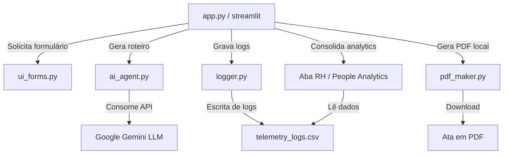

# Technical Context - Smart Leading (ClearIT)

> Este arquivo é a fonte de verdade para Engenharia. O agente `@engineer` atualizará este arquivo quando houver mudanças na arquitetura.

## 1. Stack Tecnológica
- **Linguagem:** Python 3.10+
- **Framework:** Streamlit (Interface Web e reatividade de estados)
- **Banco de Dados:** Banco local CSV (`data/telemetry_logs.csv`) em conformidade com LGPD
- **Integração de IA:** SDK Google Generative AI (`gemini-2.5-flash`)
- **Geração de Documentos:** FPDF (Exportação Nativa de PDFs de Atas locais)

## 2. Padrões de Código (Code Standards)
- **Modularização:** Divisão limpa em `components` (UI), `services` (IA, PDF), e `utils` (Logger).
- **Tratamento de Dados:** Filtro local contra informações pessoais sensíveis enviados para a IA (*Privacy by Design*).
- **Código Reativo:** Controle de concorrência e carregamento usando `st.session_state` e travas de tela.

## 3. Arquitetura Lógica (Visão Simplificada)

## 4. Histórico de Implementação (Sprint 2 - MVP)
- `src/app.py`: Estruturação da SPA, abas da Liga de Líderes por área, painel do RH e nuggets.
- `src/utils/logger.py`: Gravação inicial e atualização de atas marcadas como baixadas pelo ID do rito.
- `src/components/ui_forms.py`: Formulário de variáveis com nuggets e postura comportamental adaptada.
- `src/services/ai_agent.py`: Prompt estruturado integrando a Metodologia CRIA, escuta ativa e gamificação de Missões/Badges.
- `src/services/pdf_maker.py`: Geração de PDF nativo com divisão em duas páginas (Ata e Gamificação).
